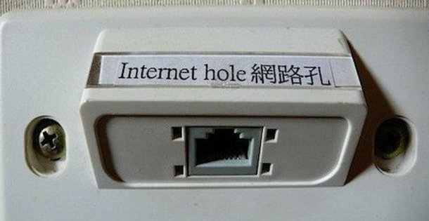
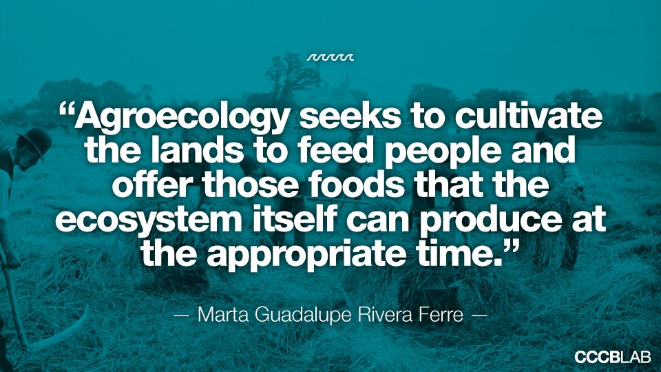

# Capitalisme digital

### Comi TIC

---

<em style="font-size: 30px">
> Si les màquines produeixen tot el que necessitem, el resultat dependrà de com es distribueixen les coses. Tothom podrà gaudir d'una vida de luxe ociós si la riquesa produïda per les màquines és compartida, o la majoria de la gent pot acabar sent miserablement pobre si els propietaris de les màquines tenen èxit en la seva pressió política contra la redistribució de la riquesa. Fins ara, la tendència sembla ser cap a la segona opció, amb la tecnologia provocant cada vegada més gran desigualtat

[Stephen Hawking a Reddit, 2015](https://www.reddit.com/r/science/comments/3nyn5i/science_ama_series_stephen_hawking_ama_answers/cvsdmkv/)
</em>

---
## Capitalisme digital

Capitalisme digital, tecnocapitalisme, societat poslaboral, PostCapitalisme

[Paul Mason - PostCapitalism: A Guide to our Future @fa[external-link gp-download]](https://en.wikipedia.org/wiki/PostCapitalism:_A_Guide_to_our_Future)

Note:
"Estem davant d'una disjuntiva clara: un model col·laboratiu o un futur distòpic, una mena de feudalisme tecnològic en què es multiplicaria la desigualtat"
"Cal mirar al futur. I en aquest futur, les idees del socialisme utòpic són avui més possibles que mai gràcies a l'evolució tecnològica "
"Els governs han de adonar-se que Uber no és bo, però que obre un camí que es pot transitar d'una altra manera. Per què no un Uber veritablement cooperatiu?"

---

## Un capitalisme més

- Neoliberal i governat pel mercat
- Transnacional i globalitzat
- Monopolístic
- Accentuador de les desigualtats socials
- Extractiu
- No contributiu
- Adreçat al consumisme entre grups privilegiats
- Colonitzador de l'educació en valors de mercat

Note:
Com el financer, com l'energètic, etc

---

## ... amb avantatges competitius

- Desregulació legislativa
  - Estratègies de fets consumats
  - Principis de mercat, abans que drets fonamentals
- Desconeixement polític i jurídic

Note:
Desregulat, dues vessants: 1. Fets consumats, 2. construït sobre capitalisme

---

## Innovació i capitalisme

Possessió de la tecnologia que dominarà la vida en el futur proper

@fa[angle-double-down]

**Poder polític i social**

@fa[angle-double-down]

...més enllà fins i tot de la indústria tecnològica

---

## Innovació i capitalisme

<em style="font-size: 30px">
> El que abans era una rica selecció de blogs i llocs web s'ha comprimit sota el pes poderós d'unes poques plataformes dominants. Aquesta concentració de poder crea un nou conjunt de guardians, permetent a un grapat de plataformes controlar quines idees i opinions es veuen i comparteixen.

[Tim Bernres-Lee, 29è aniversari de la WWW, març 2018](https://webfoundation.org/2018/03/web-birthday-29/)
</em>

Note:
Barreres als competidors, falta de diversitat.
2 mites: anuncis com a únic model de negoci, i que és massa tard per canviar com operen les plataformes

---

## GAFAM contra els pagesos digitals

- Alphabet (Google Search, Youtube, Maps, Android, Drive, Cloud) |
- Apple |
- Facebook (Whatsapp, Instagram) |
- Amazon (retailer, AWS) |
- Microsoft (Windows, Office, Azure, Skype) |

Note:
Els Montsanto i Nestlé del món digital.
Analogia: dividir territori en 5 conreus. GAFAM tenen les llavors i els mitjans. Zero respecte ecològic.
Pagesos digitals no tenen territori, han de llogar espai (Amz), llavors (G) i eines (Ap,M,G,F). Volen banc de llavors, net de pesticides, etc. Impossible en aquest terreny.
Distribuïdors són també GAFAM.

---

## El capitalisme es reinventa

- Bars, tertúlies -> Twitter |
- Hotels -> Airbnb |
- Taxis, lloguer de cotxes -> Uber |
- Hipermercats -> AliExpress, eBay |
- Cadenes de TV -> Netflix |
- Prestatgeries -> Dropbox |
- Hora del pati -> Snapchat |
- Assistents personals -> Amazon Alexa/Echo, Google Home |

Note:
Troba manera d'extreure beneficis, inclus on no hi havia.
Impacte directe en economia local.
En comú, evasió d'impostos, model de caixa negra.
Alguns també obren codi de manera interessada.
Assistents -> IoT privatiu

---

## La tecnologia no és neutra

- Submissió de la usuària |
- Model de caixa negra (privatiu) |
- Despossessió del producte/servei |
- Obsolescència programada |

Note:
Despossessió: DRM continguts digitals, llicències MS, clouds.
Obsolescència: Actualitzacions Android, requeriments hw

---

## La tecnologia no és neutra

- La privacitat és minada per beneficis
- Els serveis alternatius són escombrats

---

## Praxis

- Enginyeria fiscal/laboral |
- Priorització de continguts en base a algoritmes privatius |
- Venda de dades a tercers |
- Entrega de dades a Governs |
- Backdoors i exploits |
- Control centralitzat dels stores i marketplaces |

Note:
Laboral: Deliveroo/Globo no té empleats, Airbnb no té hotels, Uber no té conductors -> Falsa economia col.laborativa
Priorització: continguts propis i de partners
Stores: retirada d'alternatives

---

## Alguns casos (1)

- [Advertising en funció del perfil social](https://en.wikipedia.org/wiki/Social_network_advertising)
- [360 graus del consum personal (Amazon)](https://www.geekwire.com/2018/check-no-checkout-amazon-go-automated-retail-store-will-finally-open-public-monday/)
- [Laboratoris urbans (Google)](https://amp.theguardian.com/commentisfree/2017/oct/24/google-alphabet-sidewalk-labs-toronto)
- [IA per drones militars (Google)](https://static.theintercept.com/amp/google-is-quietly-providing-ai-technology-for-drone-strike-targeting-project.html)
- [Recopilació d'ubicació en Android](https://qz.com/1131515/google-collects-android-users-locations-even-when-location-services-are-disabled/)
- [Vulnerabilitat a atacs](https://es.wikipedia.org/wiki/Ataques_ransomware_WannaCry)

Note:
Més enllà de vulneracions de drets en magatzems d'Amazon

---

## Alguns casos (2)

- [Monetització de les classes desposseïdes](https://medium.com/@Michael_Spencer/americas-future-underclass-are-being-monetized-by-walmart-and-amazon-b24c4b404079)
- [Tancament de perfils polítics (Facebook)](https://www.eldiario.es/sociedad/organizacion-feminista-Femen-denuncia-Facebook_0_146986033.html)
- [Seguiment de càmera per pols en l'objectiu (Facebook)](https://gizmodo.com/facebook-knows-how-to-track-you-using-the-dust-on-your-1821030620)
- [OSINT (Open Source Intelligence)](https://en.wikipedia.org/wiki/Open-source_intelligence)
- [Filtració de dades personals: núm de telèfon (Facebook)](https://es.gizmodo.com/por-que-deberias-borrar-tu-numero-de-telefono-de-facebo-1820327397)
- [Historial de trucades a la xarxa social (Facebook)](https://twitter.com/d3d0c3d/status/897110250758819848)

Note:
Censura: un clàssic

---

## El forat digital



Note:
Paul Mason de nou:
"Estem davant d'una disjuntiva clara: un model col·laboratiu o un futur distòpic, una mena de feudalisme tecnològic en què es multiplicaria la desigualtat"
"Cal mirar al futur. I en aquest futur, les idees del socialisme utòpic són avui més possibles que mai gràcies a l'evolució tecnològica "
"Els governs han de adonar-se que Uber no és bo, però que obre un camí que es pot transitar d'una altra manera. Per què no un Uber veritablement cooperatiu?"

---

## L'economia dels pagesos digitals

- Respectuosa amb el medi ambient |
- Transparent en materials i procesos |
- Local, Km 0 |
- Sostenible |
- Respectuosa amb la comunitat |

Note:
Lliure de pesticides
Lliures d'alergens
Respectuosa amb la privacitat de la xarxa de contactes

---

## Els Procomuns

Models 
- Econòmics
- De governança
- Tecnològics
- De política de coneixement
- De responsabilitat social

Note:
Transparència, democràcia, intercooperació
Remeten a criteris de Pamapam

---

## Preguntes?
---


## Gràcies!
<br>


<br>

Llista: ```comissio_tic_pap@framalistes.org```
<br>
Riot/Matrix: ```#comissio_tic_pap:matrix.org```
---

## Cooperativisme de Plataforma

### Comi TIC

---

<em style="font-size: 24px">
>Internet ha transformat els nostres llocs de treball, les nostres relacions i les nostres societats.

</em>

<em style="font-size: 24px">
>Empreses com Uber, Amazon, Google o Facebook s'estan apoderant de sectors fonamentals de l'economia, com ara el transport o fenòmens com les cerques o les xarxes socials.

</em>

<em style="font-size: 24px">
>Les usuàries d'Internet no tenim pràcticament cap control sobre les plataformes amb les quals interactuem diàriament.

[https://platform.coop/](https://platform.coop/about)

</em>

---

## Plataformes ideals
<p style="text-align: left">Combinem l'eficiència i els menors costos de transacció de les plataformes digitals juntament amb la propietat horitzontal i el control democràtic que caracteritzen les cooperatives.</p>

* Valors de l'ESS
* Procomú digital
* Comunitats que es mouen per principis i no sols per interès


---

## Per què codi obert

* Replicabilitat
* Compartim les despeses de millora
* Seguretat, auditable
* Comunitat

---

## Reptes

<p style="text-align: left">Trobar la recepta ideal adaptada a cada cas.</p>

* Aprendre de la ESS
* Experiència de l’usuària
* Escala
* Procomú digital
* Finançament i sostenibilitat

---

## Gràcies!
<br>


<br>

Llista: ```comissio_tic_pap@framalistes.org```
<br>
Riot/Matrix: ```#comissio_tic_pap:matrix.org```

---

# Llicències lliures i de codi obert

### Comi TIC

---

## Criteri 7

_Avaluació del grau de sensibilització de la iniciativa amb els procomuns digitals i la seva contribució activa als mateixos_

---

## Criteri 7

1. Utilitzen continguts amb llicències lliures.
2. És política interna de la iniciativa prioritzar l’ús de continguts amb llicències lliures en el desenvolupament de l’activitat.
3. Publiquen algun contingut sota llicència lliure.
4. És política interna de la iniciativa publicar la major part del contingut que es produeix sota llicències lliures
i compartir-ho amb la comunitat.
5. Fan tasques de sensibilització i difusió sobre l’ús i creació de continguts sota llicències lliures.

---



<em style="font-size: 20px">
Text [@CatAgroeco](https://twitter.com/CatAgroeco) per [@CCCBLab](https://twitter.com/CCCBLab). Imatge [Harvest Time de Robert French](http://catalogue.nli.ie/Record/vtls000044306/Holdings), domini públic.
</em>

Note:
Harvest time. French, Robert, 1841-1917 photographer. Public Domain http://catalogue.nli.ie/Record/vtls000044306/Holdings

---

## Llicències lliures i Llicències de codi obert

[La Catedral i el Bazar](https://www.digitalocean.com/community/tutorials/Free-vs-Open-Source-Software)

- [Free Software Foundation License List](http://www.gnu.org/licenses/license-list.html)
- [Open Source Initiative’s Licenses & Standards](https://opensource.org/licenses)
- [Creative Commons](https://creativecommons.org/share-your-work/licensing-types-examples/)

Note:
FSF 80s, OSI darrers 90
1997 Eric S. Raymond (un dels fundadors OSI)
C: top-down, grup exclusiu, més polític. B: més efectiu a trobar i resoldre. Pràctic, descarregat políticament.

---

## El valor de les llicències lliures i obertes

Les llicències són una eina que emmiralla el compromís amb el Procomú i el respecte per les dades gestionades

Exemples: [Nodejs](https://github.com/nodejs/node/blob/master/LICENSE), [Reddit](https://www.reddit.com/r/changelog/comments/6xfyfg/an_update_on_the_state_of_the_redditreddit_and/)

Bonus: [Codi de conducta](https://github.com/nodejs/admin/blob/master/CODE_OF_CONDUCT.md), [guia de col·laboració](https://github.com/nodejs/node/blob/master/COLLABORATOR_GUIDE.md)

---

## Avaluació Criteri 7 (1)

- Quin sistema operatiu tenen els ordinadors locals? Quines eines d'ofimàtica es fan servir?
- On està desplegada la web i amb quin programari està construïda? Quina base de dades?
- Amb quines eines gestionen les seves finances?
- On es guarden els documents digitals de la iniciativa?

---

## Avaluació Criteri 7 (2)

- En quins formats distribueixen els seus documents i presentacions?
- Quines altres eines es fan servir (disseny gràfic, comunicació, marketing)?
- En desenvolupaments a mida, han alliberat codi/continguts o demanat al proveïdor que ho faci?
- Linken el seu codi apropiadament, indiquen llicències i acrediten continguts/codi de tercers?

---

## Criteri 7

[Algunes respostes](https://tec.lleialtat.cat/formacio/eines-lliures-per-la-privacitat-i-la-llibertat)

---

# Llicències Pamapam

### Comi TIC

---

## Receptes


<br>
<em style="font-size: 20px">Image by : Opensource.com</em>

[Bryan Behrenshausen - An open source analogy: Open source is like sharing a recipe @fa[external-link gp-download]](https://opensource.com/life/12/6/open-source-like-sharing-recipe)

---

## Contexte

- Pamapam Web - Entrega codi font |
- Absència de llicència = Copyright |
- Mapeig de línies estratègiques |
- Compromisos i restriccions sobre actius de la comunitat |
 - Us |
 - Modificació |
 - Distribució |

---

## Contexte

- Com es difonen...  |
  - els continguts? |
- Com evolucionen... |
  - les eines tecnològiques? |
- Com es retorna al procomú... |
  - la inversió col·lectiva? |
- On és... |
  - la comunitat? |

---

## Actius de la comunitat

- Codi |
- Contingut |
- Dades |
- Marca |

---

## Codi

- [Extensa varietat: Apache, MIT, GPL, BSD, Eclipse, etc... @fa[external-link gp-download]](https://en.wikipedia.org/wiki/Comparison_of_free_and_open-source_software_licenses) |
- Orientades a dinàmiques de codi lliure (ecosistema FOSS) |
- [Diferents nivells de llibertat  @fa[external-link gp-download]](https://en.wikipedia.org/wiki/License_compatibility#/media/File:Software-license-compatiblity-graph.svg) |
- [Compatibilitat amb components utilitzats  @fa[external-link gp-download]](https://en.wikipedia.org/wiki/License_compatibility#/media/File:Floss-license-slide-image.png) |

---

### Codi - AGPLv3


- GPL=GNU General Public License |
- Creada originalment per Richard Stallman i la Free Software Foundation (FSF) pel projecte GNU |
- Llicència més difosa en programari lliure i codi obert |
- GPLv3 Primera llicència copyleft per a us general |

---

### Codi - AGPLv3


- Versions modificades del codi romanen lliures i de codi obert |
- Extén copyleft |
 - Exigeix l'us de GPLv3 per adaptacions |
- GPLv3 esmena GPLv2 |
- A=Affero - Dissenyada per software de servidors de xarxa |

---

## Contingut

- Copyright vs Creative Commons |
- Orientades a obra digital |
- Diferent nivells de llibertat |
  - BY: reconeixement |
  - SA: derivats amb mateixa llicència |
  - NC: no $ |

---

### Contingut - Proposta 1: CC-BY-SA 4.0


- Copyleft |
- Estàndar |
- Activa |
- Acceptada i reconeguda jurídicament |

---

### Contingut - Proposta 2: Peer Production PPL


- Copyfarleft: BY-SA-NoCapitalista |
- No estàndar |
- Restriccions sobre derivades (Peer production) |
- Sense activitat recent |
- Considerada a l'entorn XES (balanç social) |

---

## Dades

- Consens actual: posició conservadora |
 - Export estàtic de dades públiques (online) |
 - Export estàtic de dades sensibles (sota demanda) |
- Llicència: Consistent amb la de continguts (CC-BY-SA 4.0 o PPL) |
- Suficient? |
 - Integració amb projectes afins (cas katuma) |
 - API pública/privada |

---

## Marca

- Sobrepassa àmbit digital |
- Qui pot replicar Pamapam, fent servir el nom? |
- Algunes marques protegides |
 - Wikipedia |
 - Apache Software Foundation |
 - Debian |
 - Eclipse Foundation |

---

## Preguntes?
---


## Gràcies!
<br>


<br>

Llista: ```comissio_tic_pap@framalistes.org```
<br>
Riot/Matrix: ```#comissio_tic_pap:matrix.org```
